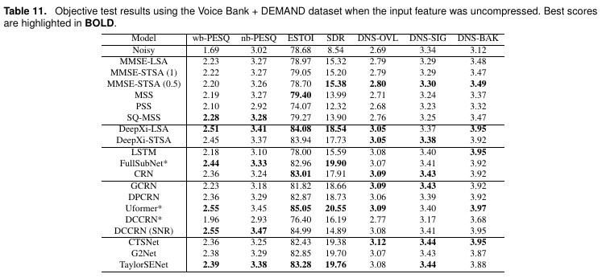
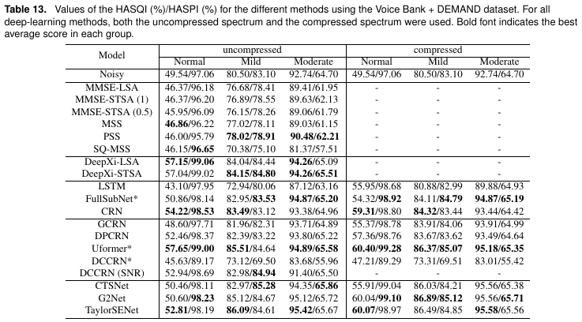

# Sixty-years-of-frequency-domain-monaural-speech-enhancement
A collection of papers and resources related to Frequency Domain Monaural Speech Enhancement. 

When using the models provided in this website, please refer to our survey: 
Chengshi Zheng#*, Huiyong Zhang, Wenzhe Liu, Xiaoxue Luo#, Andong Li, Xiaodong Li, and Brian C. J. Moore#. Sixty Years of Frequency-Domain Monaural Speech Enhancement: From Traditional to Deep Learning Methods. Trends in Hearing, in Press.
Please let us know when you find errors or have suggestions to improve the quality of this project by emails: cszheng@mail.ioa.ac.cn; luoxiaoxue@mail.ioa.ac.cn 

@article{Zheng2023SurveyTIH,
    title={Sixty Years of Frequency-Domain Monaural Speech Enhancement: From Traditional to Deep Learning Methods }, 
    author={Zheng, Chengshi and Zhang, Huiyong and Liu, Wenzhe and Luo, Xiaoxue and Li, Andong and Li, Xiaodong and Moore, Brian C. J.}, 
journal={Trends in Hearing}, 
volume = {}, 
number = {}, 
pages = {}, 
year = {2023}, 
doi = {} 
} 

## Contents: 
**Introduction** 
This survey paper first provides a comprehensive overview of traditional and deep-learning methods for monaural speech enhancement in the frequency domain. The fundamental assumptions of each approach are then summarized and analyzed to clarify their limitations and advantages. A comprehensive evaluation of some typical methods was conducted using the WSJ + DNS and Voice Bank + DEMAND datasets to give an intuitive and unified comparison. The benefits of monaural speech enhancement methods using objective metrics relevant for normal-hearing and hearing-impaired listeners were evaluated.

**Available models** 

**Results** 

