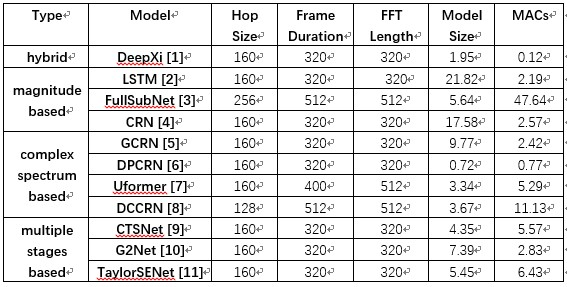
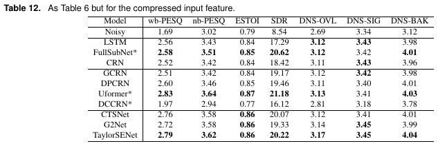

# Sixty-years-of-frequency-domain-monaural-speech-enhancement
A collection of papers and resources related to Frequency Domain Monaural Speech Enhancement. 

When using the models provided in this website, please refer to our survey: 
Chengshi Zheng#*, Huiyong Zhang, Wenzhe Liu, Xiaoxue Luo#, Andong Li, Xiaodong Li, and Brian C. J. Moore#. Sixty Years of Frequency-Domain Monaural Speech Enhancement: From Traditional to Deep Learning Methods. Trends in Hearing, in Press.
Please let us know when you find errors or have suggestions to improve the quality of this project by emails: cszheng@mail.ioa.ac.cn; luoxiaoxue@mail.ioa.ac.cn 

@article{Zheng2023SurveyTIH,
    title={Sixty Years of Frequency-Domain Monaural Speech Enhancement: From Traditional to Deep Learning Methods }, 
    author={Zheng, Chengshi and Zhang, Huiyong and Liu, Wenzhe and Luo, Xiaoxue and Li, Andong and Li, Xiaodong and Moore, Brian C. J.}, 
journal={Trends in Hearing}, 
volume = {}, 
number = {}, 
pages = {}, 
year = {2023}, 
doi = {} 
} 

## Contents: 
**Introduction** 
This survey paper first provides a comprehensive overview of traditional and deep-learning methods for monaural speech enhancement in the frequency domain. The fundamental assumptions of each approach are then summarized and analyzed to clarify their limitations and advantages. A comprehensive evaluation of some typical methods was conducted using the WSJ + DNS and Voice Bank + DEMAND datasets to give an intuitive and unified comparison. The benefits of monaural speech enhancement methods using objective metrics relevant for normal-hearing and hearing-impaired listeners were evaluated.

**Available models** 

**Results** 

**Citation guide** 
[1] Nicolson A and Paliwal KK (2019) Deep learning for minimum mean-square error approaches to speech enhancement. Speech Communication 111: 44–55. DOI: https://doi.org/10.1016/j.specom.2019.06.002. 
[2] Sun L, Du J, Dai LR and Lee CH (2017) Multiple-target deep learning for LSTM-RNN based speech enhancement. In: 2017 Hands-free Speech Communications and Microphone Arrays (HSCMA). pp. 136–140. DOI:10.1109/HSCMA.2017. 7895577. 
[3] Hao X, Su X, Horaud R and Li X (2021) Fullsubnet: A full-band and sub-band fusion model for real-time single-channel speech enhancement. In: 2021 IEEE International Conference on Acoustics, Speech and Signal Processing. pp. 6633–6637. DOI: 10.1109/ICASSP39728.2021.9414177. 
[4] Tan K and Wang D (2018) A convolutional recurrent neural network for real-time speech enhancement. In: Proc. Interspeech 2018. pp. 3229–3233. DOI:doi:10.21437/Interspeech.2018-1405. 
[5] Tan K and Wang D (2020) Learning complex spectral mapping with gated convolutional recurrent networks for monaural speech enhancement. IEEE/ACM Transactions on Audio, Speech, and Language Processing 28: 380–390. DOI:10.1109/TASLP. 2019.2955276. 
[6] Le X, Chen H, Chen K and Lu J (2021) DPCRN: Dualpath convolution recurrent network for single channel speech enhancement. arXiv preprint arXiv:2107.05429. 
[7]Fu Y, Liu Y, Li J, Luo D, Lv S, Jv Y and Xie L (2022) Uformer: A Unet based dilated complex and real dual-path conformer network for simultaneous speech enhancement and dereverberation. In: 2022 IEEE International Conference on Acoustics, Speech and Signal Processing. pp. 7417–7421. DOI: 10.1109/ICASSP43922.2022.9746020. 
[8] Hu Y, Liu Y, Lv S, Xing M, Zhang S, Fu Y, Wu J, Zhang B and Xie L (2020) DCCRN: Deep complex convolution recurrent network for phase-aware speech enhancement. arXiv preprint arXiv:2008.00264. 
[9] Li A, Liu W, Luo X, Zheng C and Li X (2021b) ICASSP 2021 Deep Noise Suppression Challenge: Decoupling magnitude and phase optimization with a two-stage deep network. In: ICASSP 2021 - 2021 IEEE International Conference on Acoustics, Speech and Signal Processing (ICASSP). pp. 6628–6632. DOI: 10.1109/ICASSP39728.2021.9414062. 
[10] Li A, Zheng C, Zhang L and Li X (2022b) Glance and gaze: A collaborative learning framework for single-channel speech enhancement. Applied Acoustics 187: 108499. DOI:https: //doi.org/10.1016/j.apacoust.2021.108499. 
[11]Li A, You S, Yu G, Zheng C and Li X (2022a) Taylor, can you hear me now? a Taylor-unfolding framework for monaural speech enhancement. In: Raedt LD (ed.) Proceedings of the Thirty-First International Joint Conference on Artificial Intelligence, IJCAI-22. International Joint Conferences on Artificial Intelligence Organization, pp. 4193–4200. DOI: 10.24963/ijcai.2022/582. Main Track. 
